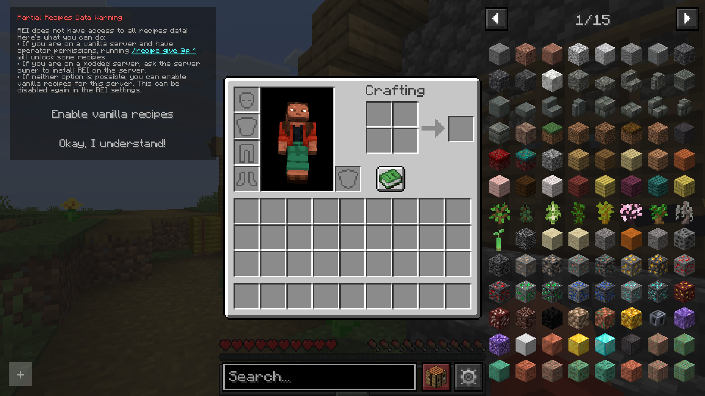
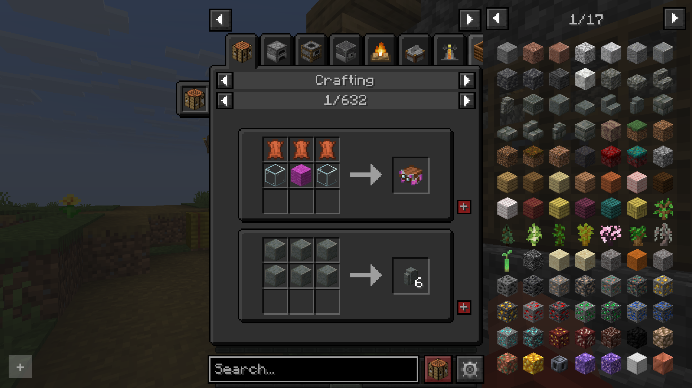
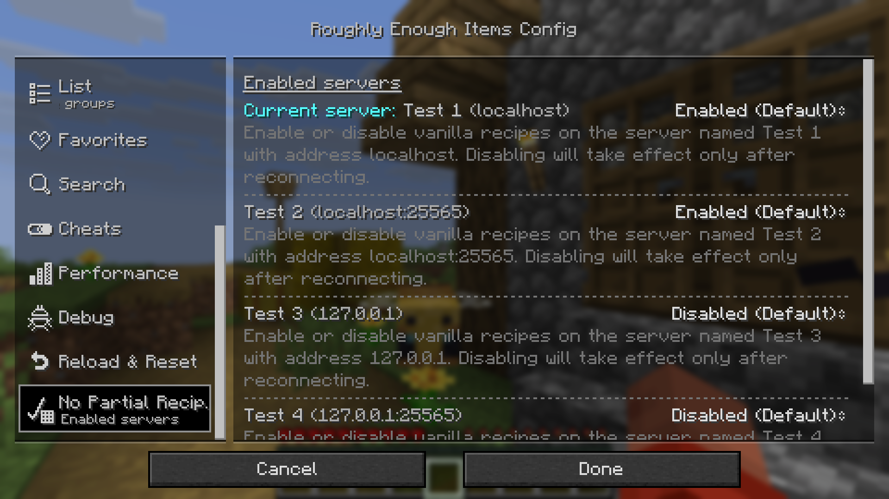

# REI No Partial Recipes

# Important notice

As the functionality got added in 26.1+ ([Commit 2cf8690](https://github.com/shedaniel/RoughlyEnoughItems/commit/2cf86900ad5718081e32847054507f7b8ad92a36))
of REI itself, this mod will **no longer receive any ports to new versions**.
If you need a backport to an older version, please create [issue on GitHub](https://github.com/Pr77Pr77/REI-No-Partial-Recipes/issues) or create a ticket on my [discord server](https://discord.gg/wfeM63Jar5).

---

This Mod allows REI to display all vanilla recipes on servers that do not use REI.
Please note this mod does not replace REI on the server. It is ony meant as workaround,
if you can't install REI on the server, because it is fully vanilla or a public server.

## Installation

This mod is only supported by the Fabric mod loader. For installation guides regarding Fabric
please use the official [Fabric player guides](https://docs.fabricmc.net/players/).

You can download the mod on either [Modrinth](https://modrinth.com/mod/rei-no-partial-recipes) or on [GitHub](https://github.com/Pr77Pr77/REI-No-Partial-Recipes)
under [releases](https://github.com/Pr77Pr77/REI-No-Partial-Recipes).
This mod needs the following dependencies:

- [Fabric API](https://modrinth.com/mod/fabric-api)
- [Roughly Enough Items](https://modrinth.com/mod/rei)
- Optional: [Mod Menu](https://modrinth.com/mod/modmenu)

## Using the mod

To use the mod, go on a server you want to have full vanilla recipes. You should then see an option added to the warning:

*The Partial Recipes Data Warning with the option to enable vanilla recipes*

Now, you should have full access to the vanilla recipes:

*Vanilla recipes provided by this mod*

To manage, which servers the mod is activated for, go to the REI settings, scroll down on the left side and select "No Partial Recip.".
On the right side you can then enable or disable the mod for specific servers from your server list:

*The mod's settings embedded within REI's settings*

> I accept no liability for any damages caused by using this mod. Use at your own risk!

## Reporting issues, getting help and suggesting features

If you have trouble using the mod, if you stumble upon a bug or if you want to suggest a feature to be implemented,
please don't hesitate to post an [issue on GitHub](https://github.com/Pr77Pr77/REI-No-Partial-Recipes/issues).
I will try to respond as soon as possible and maybe ask follow-up questions.